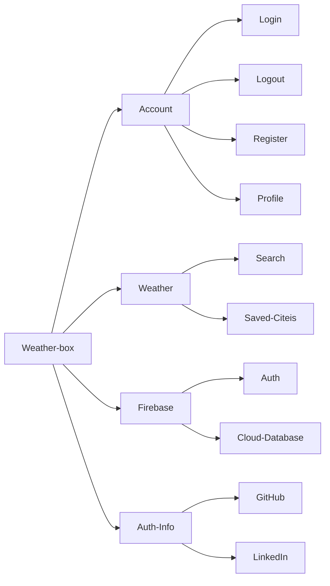

# WeatherBox

This project is Angular framework with Firebase

## Features
Let's getting started our journey on Angular. 

Here contains all of features that will implement into this project.

### Account
- AuthFirebase
- Profile
- FormModule
- ReactiveFormModule
- Validation
- Upload Img

### Weather
- Integration Weather Open API and Google Map
- Search city and display google map
- Save cities

### Firebase
- Auth
- Firestore
- Hosting
- Deploy

### Auth-Info
- display img, name, github link
- generate QR code of github link or linkedIn link

### Setting
- receive notification
- with or without Internet access search or play songs
- i18n
